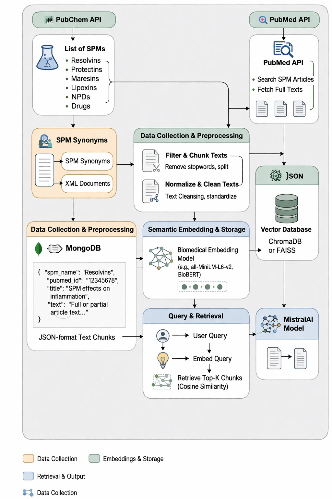

# Biomedical-RAG : RAG-Approach-on-SPIN

## 📌 Overview

This project automate the extraction of SPM–target protein interactions from PubMed articles using RAG and LLM-based relation extraction.

It converts unstructured scientific papers into:
- Structured knowledge  
- Evidence-based answers  
- Queryable biomedical insights  

---

## 🔬 Problem Statement

Biomedical literature is vast, fragmented, and inconsistent, making it difficult to extract structured insights—especially for Specialized Pro-Resolving Mediators (SPMs), which regulate inflammation and immune response.

---

## 🎯 Objectives

- Expand SPM terminology using PubChem synonyms
- Retrieve research papers from PubMed / PMC
- Enable semantic search using embeddings
- Build a RAG chatbot for Q&A
- Extract SPM–protein interactions with evidence
- Visualize relationships using Neo4j

---

## 🏗️ System Architecture

<p align="center">
  
</p>

---

## 🧩 Tech Stack

- Python  
- MongoDB  
- FAISS  
- Sentence Transformers (SBERT)  
- Mistral AI  
- Streamlit  
- Neo4j  

---

## ⚙️ Methodology

1. Synonym Expansion (PubChem)
2. Literature Retrieval (PubMed APIs)
3. Data Storage (MongoDB)
4. Semantic Indexing (SBERT + FAISS)
5. RAG-based QA
6. Interaction Extraction
7. Knowledge Graph (Neo4j)

---

## 📊 Results

- 57 SPMs processed  
- ~9,700 papers collected  
- ~54,000 chunks indexed  
- 140 interactions extracted  
- 61 unique proteins identified  


---

```
## 🎥 Project Demo

[](https://drive.google.com/file/d/16Gohn8iNKkTA3zEZktclLExaFB8XuR8y/view?usp=drive_link)
```
